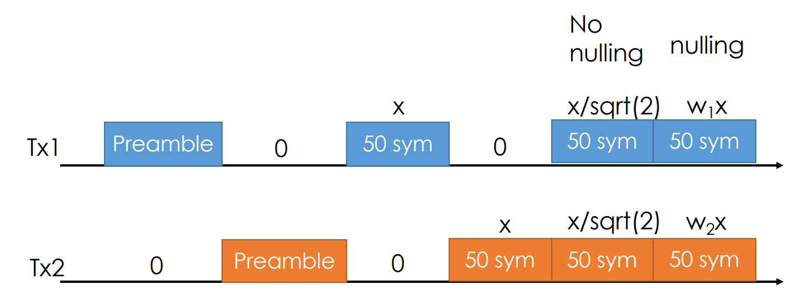
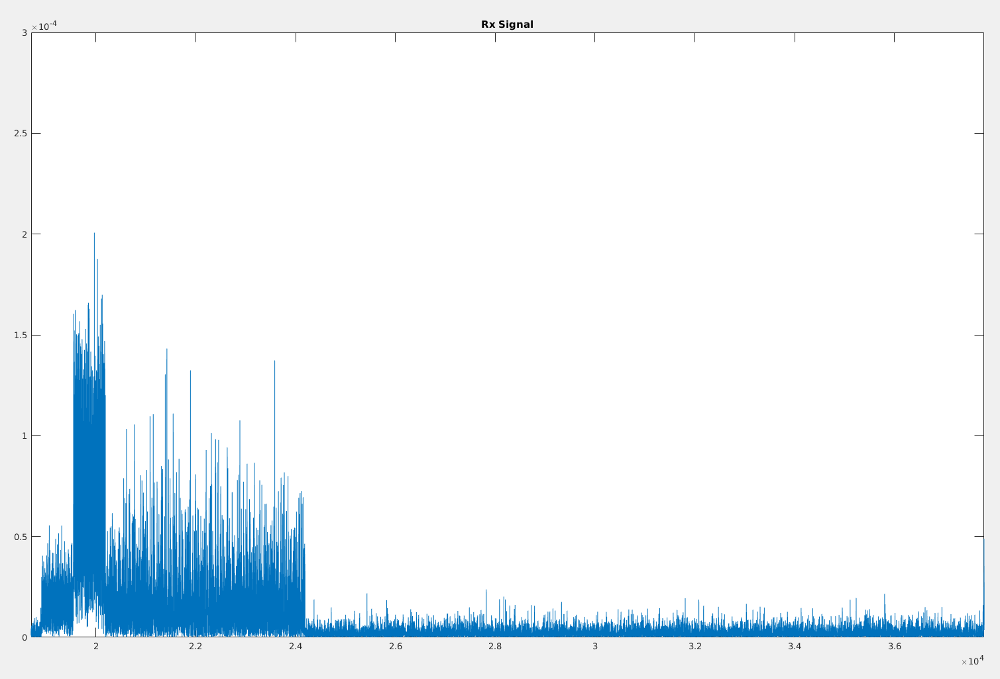
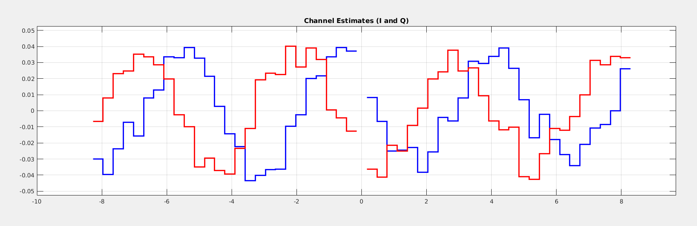

# Interference Nulling over USRP

In this repository, we are going to simulate "interference nulling" in simple MIMO OFDM with BPSK demodulation by using the example code on [WARPLab](https://warpproject.org/trac/wiki/WARPLab/Examples/OFDM) `wl_example_siso_ofdm_txrx.m`. This repository is extended from my another repository - [Simple SISO OFDM MATLAB simulation](https://github.com/yungshenglu/Simple_SISO_OFDM).

> **NOTCIE:** This repository is the assignment in NCTU course "Wireless Communication Systems 2018". If you are taking this course, please do not duplicate from this repository. All rights reserved.

---
## Description

The sample code `wl_example_siso_ofdm_txrx.m` follows the following steps.
1. Generate OFDM transmit samples
2. Send samples via WARP or Simulation transmission
3. Decode the received samples
4. Calculate SNR / channels and plot

In the part of signal generation,
1. Generate preambles
2. Generate digital bits
3. Modulate digital bits to frequency-domain samples
4. Add pilot samples
5. Convert frequency sample to time samples via FFT
6. Insert CP (Cyclic Prefix)
7. Reshape symbols to 1D samples

In the part of decoding,
1. Packet detection
2. CFO correction (useless in simulation)
3. Channel estimation
4. Remove CP
5. Convert time samples to frequency samples via FFT
6. Decode frequency samples
7. SFO correction

### Interference Nulling over USRP

> **NOTICE:** The most of works can follow by my another repository - [InterferenceNulling](https://github.com/yungshenglu/InterferenceNulling).

* USRP driver (API)
    * About UHD
        * USRP Hardware Driver
        * C++ API
        * [USRP Hardware Driver and USRP Manual](http://files.ettus.com/manual)
        * [GitHub Repo - EttusResearch/uhd](https://github.com/EttusResearch/uhd)
    * Locating devices (depend on your devices)
        * `host/build/utils/uhd_find_devices --args "addr=192.168.10.14"`
        * This program scans the network for supported devices and prints out a list of discovered devices and their IP addresses
* Packet Format
    
* Signal Generation (`signal_gen.m`)
    * In this program, we remove the channel $H$ from all signals.
    * Then, we save the preamble in time-domain and payload in frequency-domain in the file named `tx_freq_vec.bin`.
* Data Trasmission (`nulling.cpp`)
    1. Channel estimation
        * After receiving preambles in Tx1 and Tx2, we extract LTS1 and LTS2 in Tx1 and Tx2 respectively.
        * Then, we transfer LTS1 and LTS2 from time-domain to frequency-domain by doing FFT.
        * We estimate channel on Tx1 and Tx2 and calculate precoding coefficient $W_1$ and $W_2$ of Tx1 and Tx2.
    2. Signals without precoding
        * We transmit payload of tx_freq_vec.bin in time-domain on Tx1 and transmit 0 with same length of Tx1 on Tx2.
        * Next, we let Tx2 transmit payload of `tx_freq_vec.bin` in time-domain and let Tx1 transmit 0 with same length of Tx2.
        * Finally, we transmit payload of `tx_freq_vec.bin` in time-domain on both Tx1 and Tx2.
    3. Precoding signals
        * First of all, we multiply payload of Tx1 and Tx2 by precoding coefficient $W_1$ and $W_2$.
        * Then, we do IFFT to transform the payload from frequency-domain to time-domain. We ensure the number of symbol over the length of two preambles plus first of three payloads.
    4. Save files
        * We save all the signals on Rx into files named `rx_signals.bin`.
* Decoding (`decode.m`)
    * First of all, we read the raw data of Rx from `rx_signals.bin` and plot figure 1.
    * Then, we pick one of the best packet from raw data to find the first index of payload as the method we used in Lab 3.
    * We do channel estimation on preambles in raw data. After that, we plot the result in figure 2.
    * We extract the payload in raw data of `tx_freq_vec.bin` and calculate SNR of the first segment signals (i.e., only Tx1 signals)

---
## Execution

### Environment


### Preliminary: FFT library Installation

* Use the library [FFTW3](http://www.fftw.org/)
* Add linking library to `/uhd/host/example/CMakeList.txt`
    * Add `fftw3` and `m` to link library in `CMakeList.txt` (around line 52)
        ```
        FOREACH(example_source ${example_sources})
        GET_FILENAME_COMPONENT(example_name ${example_source} NAME_WE)
        ADD_EXECUTABLE(${example_name} ${example_source})
        TARGET_LINK_LIBRARIES(${example_name} uhd ${Boost_LIBRARIES})
        ...
        TARGET_LINK_LIBRARIES(${example_name} uhd fftw3 m ${Boost_LIBRARIES})
        ENDFOREACH(example_source)
        ```
    * Clean all things in build directory, and `cmake` again

### Execution

* Open your MATLAB IDE and run `main.m`
* If succeed, you will get some figures and result as follow:
    * Fig. 1: Raw Received Signal
        
    * Fig. 2: Channel Estimates (I and Q)
        
* The decoding SNR will probably be 4.4854 (dB)

---
## Contributor

> **NOTICE:** You can follow the contributing process [CONTRIBUTING.md](CONTRIBUTING.md) to join me. I am very welcome any issue!

* [David Lu](https://github.com/yungshenglu)

---
## License

> **NOTICE:** This repository is the assignment in NCTU course "Wireless Communication Systems 2018". If you are taking this course, please do not duplicate from this repository. All rights reserved.

[GNU GENERAL PUBLIC LICENSE Version 3](LICENSE)
